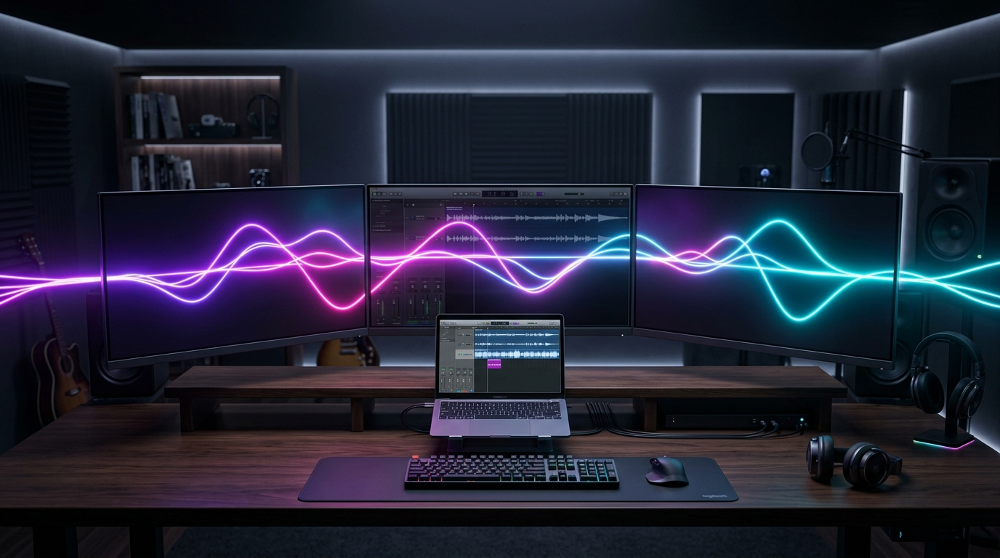

# monitor-speakers

<p align="center">
  
</p>

<p align="center"><b>English</b> | <a href="README.zh-CN.md">中文</a></p>

A free replacement for Rogue Amoeba Loopback for one specific job: routing
system audio across three monitor speakers as a single wide stereo field.

```
system output → BlackHole 2ch ──┐
                                 │   aggregate device "LG TriSpeakers" (8 ch)
                                 │   ch 0-1  BlackHole  (loopback input, output muted)
                 router IOProc ──┤   ch 2-3  monitor A  ← L
                                 │   ch 4-5  monitor B  ← L/R stereo (or mono mix)
                                 │   ch 6-7  monitor C  ← R
```

BlackHole and the monitors live inside the *same* aggregate device, so the
CoreAudio HAL handles clock drift compensation between them. The router is a
single IOProc that copies the BlackHole loopback input to the monitor output
channels through a fixed mixing matrix. Latency is one IO buffer
(256 frames ≈ 5 ms at 48 kHz).

## Why

I already had three monitors fanned across the desk, each with a decent pair of
speakers sitting there unused. Instead of buying a dedicated set of desk speakers,
I wondered: why not put the ones I already own to work — all three at once?

Spreading the stereo image across three physically separated panels turns the whole
desk into a soundstage. The left monitor carries the left channel, the right monitor
the right, and the center fills the middle. Because the sources are a meter or two
apart instead of crammed into one enclosure, the result is noticeably wider and more
enveloping than a single monitor or a small pair of near-fields — and it costs nothing
beyond hardware that was already on the desk. (Loopback, the usual tool for this kind
of routing, is paid software; this is about a hundred lines of Swift.)

## Requirements

- [BlackHole 2ch](https://existential.audio/blackhole/) (free virtual audio driver)
- Monitors with speakers, connected so each appears as a CoreAudio output device

## Build

```sh
make            # produces bin/monitor-speakers
```

## Setup

```sh
bin/monitor-speakers setup            # create the aggregate device
bin/monitor-speakers test             # plays a tone per channel pair (2, 4, 6)
bin/monitor-speakers map 2 4 6        # assign pairs to left/center/right if defaults are wrong
bin/monitor-speakers default "BlackHole 2ch"   # route system audio into the pipeline
bin/monitor-speakers run              # start routing (foreground, Ctrl-C stops)
```

Optional:

```sh
bin/monitor-speakers gain 0.8         # software master gain (0.0-2.0)
bin/monitor-speakers trim right 0.8   # per-monitor gain trim
bin/monitor-speakers sub off          # 2.1 bass management (see below)
bin/monitor-speakers sub freq 150     # crossover frequency (40-300 Hz)
bin/monitor-speakers sub trim 1.2     # bass speaker level (0.0-2.0)
bin/monitor-speakers center mono      # center monitor: mono (L+R)/2 instead of own stereo
bin/monitor-speakers autoswitch off   # disable automatic default-output switching
bin/monitor-speakers install          # launchd agent: auto-start at login
bin/monitor-speakers uninstall        # remove the agent
bin/monitor-speakers status           # config + device availability
bin/monitor-speakers teardown         # destroy the aggregate device
```

`install` copies the binary to `~/Library/Application Support/monitor-speakers/`
(launchd must not depend on an iCloud-synced path) and logs to
`/tmp/monitor-speakers.log`.

## Notes

- **Microphone permission**: reading the BlackHole loopback counts as audio
  *input*, so macOS asks for microphone access on first run. Click Allow.
- **Volume keys**: with BlackHole as the default output, keyboard volume keys
  control BlackHole's virtual volume, which scales everything downstream. Use
  `gain` for an additional software trim.
- **Identifying monitors**: the three sub-devices keep the order printed by
  `setup` (transport shown per pair). Use `test` + `map` once; the mapping is
  stored in `~/.config/monitor-speakers/config.json`.
- **Auto-switch** (on by default): the `run` daemon watches the device list.
  When all monitors appear (dock plugged in) it sets the default output to
  BlackHole; when they all disappear it falls back to the built-in speakers.
  Edge-triggered with a 2 s debounce, so manually picking another device
  (AirPods, etc.) is respected until the next connect/disconnect event.
- **Switching back**: `bin/monitor-speakers default "<your speakers>"` returns
  the system to any other output device; the router can stay running idle.

## Menu bar app

`make app` builds `bin/Monitor Speakers.app` — a menu-bar front-end that runs
the router in-process (replacing the launchd agent; uninstall the agent first
to avoid double routing). The status-item menu exposes crossover frequency,
bass level, bass on/off, center-monitor mode, output auto-switch, a
"Rebuild Aggregate" action for after re-cabling, and Launch at Login
(ServiceManagement). Copy it to `/Applications` and grant the microphone
prompt once — the bundle carries a proper usage description, and the CLI keeps
working against the same config file. The app is ad-hoc signed, so each
rebuilt binary triggers one new microphone prompt; the engine starts off the
main thread and retries quietly, so the icon appears immediately and routing
resumes the moment permission is granted.

## 2.1 bass management

Monitor speakers have no low end. If a better speaker sits on the desk (a
speakerphone, a small monitor speaker — anything CoreAudio sees as an output
device), `setup` adds it to the aggregate as a bass speaker: the router
low-passes an (L+R)/2 mono bus into it and high-passes the monitors with the
matching 4th-order Linkwitz-Riley crossover (flat sum, zero allocation on the
audio thread). Configure the device name via `subName` in the config file
(default "Insta360 Wave"); `sub freq` moves the crossover, `sub trim` sets the
bass level. Prefer a wired (USB) connection — Bluetooth adds 100-300 ms and
audibly smears the bass behind the satellites; `setup` warns in that case.
Bass below ~120 Hz carries no directional cue, so stereo imaging stays on the
monitors.

## Troubleshooting: no sound after re-docking

The `run` daemon self-heals across dock cycles (it rebuilds its IOProc when
the aggregate's channel count or device ID changes). If there is still no
sound, the failure is usually below this program. Escalate in order, checking
`tail /tmp/monitor-speakers.log` after each step:

0. **Moved desks / re-cabled?** Check `bin/monitor-speakers status`: if the
   aggregate shows fewer output channels than expected (e.g. `4 out ch`
   instead of 8), the monitors' CoreAudio UIDs changed — the UID encodes the
   port, so plugging into a different port makes a monitor a *new* device
   and the aggregate silently drops it. The log shows the supervisor retrying
   with `pair exceeds aggregate output channels`. Fix: `setup` → `test` →
   `map` (the mapping usually needs re-checking too since positions changed).
1. **Restart the daemon**: `launchctl kickstart -k gui/$UID/com.monitor-speakers.router`
2. **`AudioDeviceStart failed (OSStatus 1937010544)`** in the log — that is
   `'stop'` / `kAudioHardwareNotRunningError`: CoreAudio cannot start IO on
   the monitors at all. Verify with a direct test
   (`bin/monitor-speakers default <monitor UID fragment>` + `afplay some.wav`);
   if even that fails, the wedge is system-level, not this program:
3. **Restart CoreAudio**: `sudo killall coreaudiod`
4. **Re-seat the dock / display cables**, or power-cycle the monitors
5. **Reboot** — clears a wedged kernel display-audio driver (all monitors
   dead on HDMI *and* DisplayPort while the built-in speakers still work is
   the signature; nothing in user space fixes that)

Diagnostic: a healthy daemon shows a realtime audio thread
(`com.apple.audio.IOThread.client`) in `sample <pid> 1`.

## License

[MIT](LICENSE)
